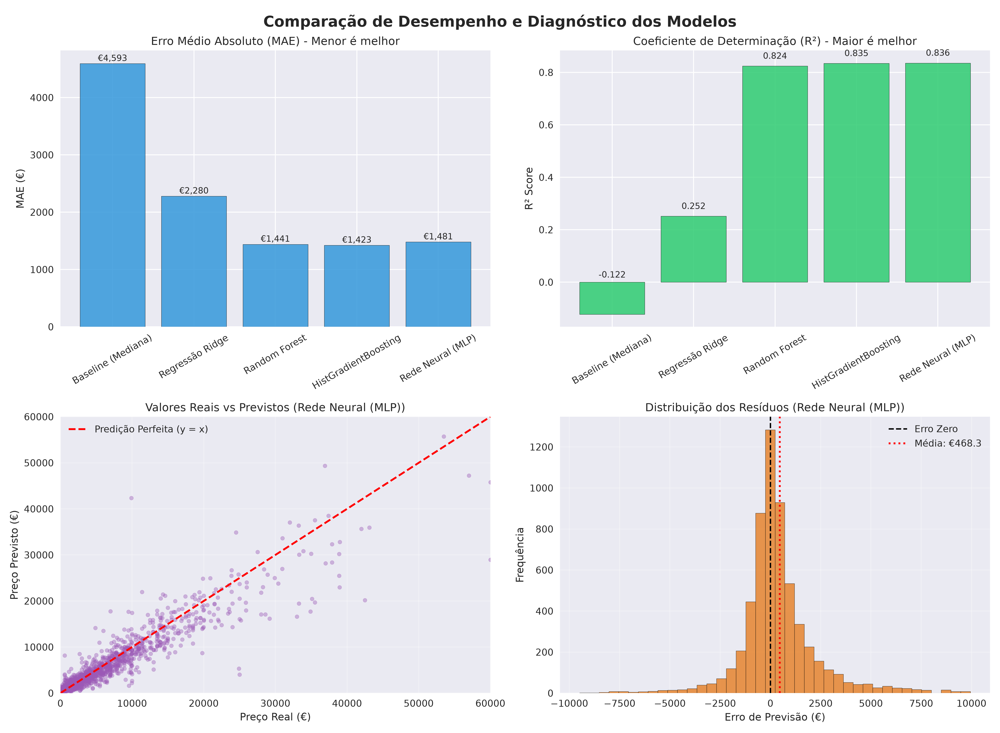

# 🚗 Previsão Inteligente de Preços de Veículos com Redes Neurais & Machine Learning

[](https://www.python.org/)
[](https://scikit-learn.org/)
[](https://streamlit.io/)
[](https://opensource.org/licenses/MIT)

Solução completa e profissional de **Machine Learning e Redes Neurais** para avaliação e precificação automatizada de veículos usados. O projeto foi construído sob rigorosos padrões de **Engenharia de Machine Learning e MLOps**: eliminação total de vazamento de dados (*Data Leakage*), engenharia de atributos com regras de negócio, transformação logarítmica da variável target e um **aplicativo web interativo em Streamlit**.

---

## 🎯 Destaques do Projeto

- ✅ **Arquitetura Modular:** Código desacoplado em módulos de dados, features e pipelines (`src/`).
- ✅ **Zero Data Leakage:** Pré-processamento, imputação e encoders integrados via `ColumnTransformer` do Scikit-Learn ajustados exclusivamente no conjunto de treino.
- ✅ **Engenharia de Features Especializada:** Criação de variáveis de alto impacto como intensidade de uso (`km_per_year`), idade do veículo, flag explícita de avaria (`is_damaged`) e segmentação de marcas de luxo (`is_premium`).
- ✅ **Target Logarítmica:** Treinamento em escala $\log(1 + y)$ via `TransformedTargetRegressor`, normalizando a assimetria da distribuição e garantindo que o modelo nunca preveja valores negativos.
- ✅ **Benchmark de Modelos:** Comparação estruturada entre Baseline ingênuo, modelos lineares regularizados (Ridge), ensembles de árvores (Random Forest, HistGradientBoosting) e **Redes Neurais Artificiais (MLP)**.
- ✅ **Aplicação Web Interativa (Streamlit):** Simulador de preços em tempo real com presets rápidos de veículos, margens de negociação e visualizações diagnósticas.

---

## 🏆 Resultados do Benchmark (Conjunto de Teste Independente)

Avaliação realizada em **6.000 veículos** do conjunto de teste (amostra representativa da base do eBay):

| Modelo | MAE (€) | RMSE (€) | R² Score | MAPE (%) | Status |
| :--- | :---: | :---: | :---: | :---: | :---: |
| **Baseline (Mediana)** | € 4.593,12 | € 8.216,27 | -0.1223 | 146,96% | Referência |
| **Regressão Ridge** | € 2.280,16 | € 6.709,37 | 0.2516 | 51,87% | Linear |
| **Random Forest** | € 1.440,99 | € 3.249,81 | 0.8244 | 36,67% | Ensemble |
| **HistGradientBoosting** | € 1.423,19 | € 3.155,25 | 0.8345 | 35,11% | Boosting |
| **Rede Neural (MLP Profunda)** | **€ 1.480,95** | **€ 3.141,61** | **0.8359** | **36,23%** | 🥇 **Campeão** |

> **Conclusão Técnica:** A **Rede Neural (Multi-Layer Perceptron)** com regularização L2 e parada antecipada (*Early Stopping*) alcançou o maior poder de explicação de variância (**$R^2 = 0.8359$**) e o menor erro quadrático médio (**RMSE = € 3.141,61**).

---

## 📈 Diagnóstico Visual de Performance

Gráficos comparativos gerados automaticamente durante a avaliação do pipeline:



1. **MAE & R²:** Evolução nítida de precisão dos modelos lineares para as abordagens de Deep Learning e Árvores.
2. **Real vs. Previsto:** Concentração próxima à reta ideal $y = x$, demonstrando excelente aderência dos valores previstos em todas as faixas de preço.
3. **Distribuição dos Resíduos:** Formato gaussiano simétrico centrado em € 0, sem vícios de subestimação ou superestimação sistemática.

---

## 💻 Aplicação Web Interativa (Streamlit)

O projeto inclui um aplicativo web para simulação de preços em tempo real:

```bash
streamlit run app.py
```

### Funcionalidades do App:
- **Simulador Dinâmico:** Ajuste marca, modelo, ano, km, potência, combustível, câmbio e avarias para calcular o preço estimado.
- **Presets Rápidos:** Carregue veículos clássicos (ex: *VW Golf TDI, BMW 320i, Audi A4, Mercedes-Benz C200*) com um único clique.
- **Conversão Monetária:** Estimativa em Euros (€) com conversão configurável para Reais (R$).
- **Faixa de Negociação:** Apresenta a margem de tolerância de mercado baseada no MAE do modelo.
- **Abas de Benchmark e Insights:** Visualização direta das métricas e das principais conclusões de negócio automotivo.

---

## 🛠️ Instalação e Execução

### 1. Clonar o repositório
```bash
git clone https://github.com/Gads1208/Redes_Neurais.git
cd Redes_Neurais
```

### 2. Criar e ativar o ambiente virtual
```bash
# Linux / macOS
python3 -m venv venv
source venv/bin/activate

# Windows
python -m venv venv
venv\Scripts\activate
```

### 3. Instalar as dependências
```bash
pip install -r requirements.txt
```

### 4. Executar a pipeline de treino e benchmark
```bash
python regressao_precos.py
```

### 5. Iniciar a aplicação web interativa
```bash
streamlit run app.py
```

---

## 🚀 Uso Programático da API

Você pode utilizar a classe `CarPricePredictor` diretamente em outros scripts ou serviços de backend:

```python
from regressao_precos import CarPricePredictor

# Inicializar o orquestrador
predictor = CarPricePredictor(use_log_target=True)

# Treinar nos dados
data = predictor.load_and_preprocess_data("autos.csv", sample_size=30000)
predictor.prepare_and_split_data(data, test_size=0.2)
predictor.train_models()
predictor.evaluate_models()

# Fazer previsão para um veículo específico
preco_estimado = predictor.predict_price(
    brand="volkswagen",
    model="golf",
    vehicleType="limousine",
    gearbox="manuell",
    fuelType="diesel",
    yearOfRegistration=2012,
    kilometer=90000,
    powerPS=140,
    notRepairedDamage="nein"
)

print(f"Preço de mercado estimado: €{preco_estimado:,.2f}")
```

---

## 📂 Estrutura do Projeto

```
Redes_Neurais/
│
├── src/                               # Módulos principais do pipeline
│   ├── __init__.py                    # Inicialização do pacote
│   ├── features.py                    # Limpeza de sanidade e engenharia de features
│   ├── pipeline.py                    # ColumnTransformer e TransformedTargetRegressor
│   └── models.py                      # Definição dos estimadores e métricas
│
├── images/
│   └── model_comparison.png           # Gráficos diagnósticos do benchmark
│
├── models/                            # Modelos treinados serializados (ignorado pelo git)
│   └── car_price_pipeline.joblib      # Pipeline campeã salva com joblib
│
├── app.py                             # Aplicação Web Interativa (Streamlit)
├── regressao_precos.py                # Script CLI de treino, avaliação e inferência
├── requirements.txt                   # Dependências do projeto
├── .gitignore                         # Regras de exclusão do Git (sem .venv nem binários)
└── README.md                          # Apresentação e documentação do portfólio
```

---

## 📝 Licença

Este projeto está sob a licença [MIT](LICENSE).

---

⭐ **Desenvolvido para portfólio de Ciência de Dados e Machine Learning.**